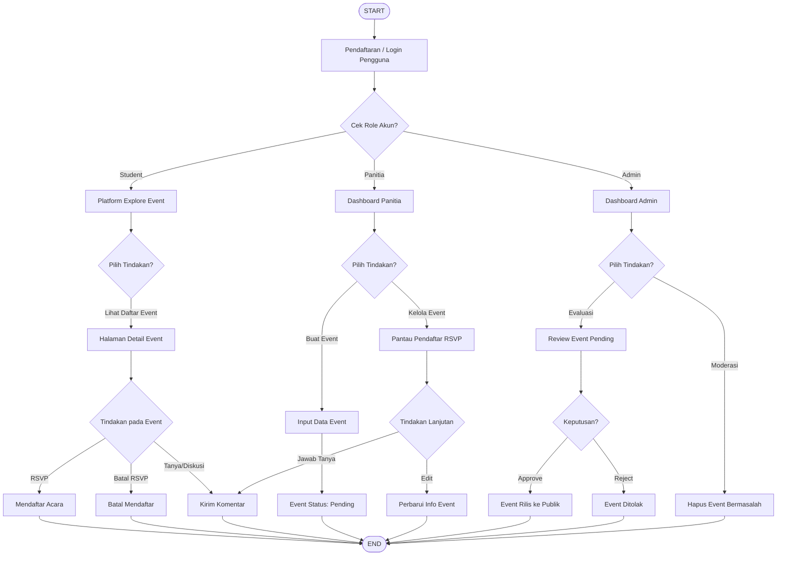
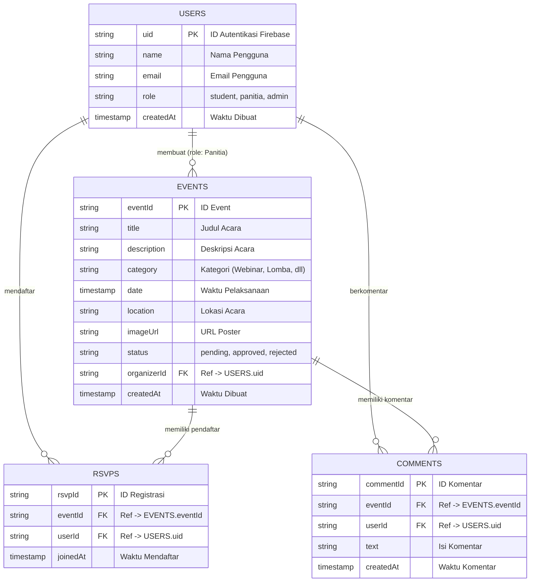

**PROPOSAL REKAYASA PERANGKAT LUNAK**

**DOSEN PENGAMPU:**
RIZKY WANDRI, S.Kom., M.Kom

**Disusun Oleh:**
1. AHMAD FADIL (223510656)
2. AHMAD QUREY SINAGA (233510809)
3. DANIEL DHERO SAPUTRA (233510716)
4. GHOTVAN NAZHIR (233510633)
5. JASMINE AISHA MELINDA FITRI (233510468)
6. MUHAMMAD FARHAN JAYANDRA (233510171)
7. RIFQI PERMANA PUTRA (233510309)
8. SIGIT SUMITRO (233510750)

**TEKNIK INFORMATIKA**
**FAKULTAS TEKNIK**
**UNIVERSITAS ISLAM RIAU**
**2024**

---

## KATA PENGANTAR

Puji syukur kehadirat Tuhan Yang Maha Esa yang telah melimpahkan segala karunianya sehingga setelah mengorbankan segenap waktu, pikiran dan tenaga penulis mendapat peluang untuk menulis proposal judul proyek untuk menyelesaikan mata kuliah Rekayasa Perangkat Lunak di Program studi S1 Jurusan Teknik Informatika di Universitas Islam Riau.

Dalam proposal ini penulis menggambarkan suatu rancangan perangkat lunak bernama **EventHub Campus** yang digunakan untuk mempermudah publikasi, manajemen acara, dan sistem RSVP di lingkungan kampus. Perangkat lunak ini dikembangkan menggunakan React.js, Firebase, dan Google Cloud Run. Dengan perancangan software ini diharapkan dapat membantu seluruh pihak yang membutuhkan informasi dan regulasi manajemen acara kampus.

Dalam kesempatan ini pula penulis mengucapkan banyak terima kasih kepada Universitas Islam Riau yang telah memberikan kami kesempatan untuk menuntut ilmu, serta kepada semua pihak yang telah membantu dalam penulisan proposal ini.

Penulis berharap melalui tulisan ini, dapat saling membagi ilmu yang sedikit ini sehingga dikemudian hari dapat bermanfaat untuk kita semua.

---

## DAFTAR ISI

KATA PENGANTAR
DAFTAR ISI
BAB 1 PENDAHULUAN
1.1 Latar Belakang
1.2 Rumusan Masalah
1.3 Tujuan
1.4 Batasan masalah
1.5 Metodologi
1.5.1 Persiapan
1.5.2 Diskusi
BAB 2 PEMBAHASAN
2.1 Algoritma Pemrograman
2.2 Flowchart
2.3 Entity Relationship Diagram (ERD)
2.4 Tahapan Pengembangan Aplikasi
2.5 Rencana Penugasan
BAB 3 PENUTUP
3.1 Kesimpulan
DAFTAR PUSTAKA

---

## BAB 1 PENDAHULUAN

### 1.1 Latar Belakang
Pendidikan tinggi tidak hanya berfokus pada kegiatan akademik di dalam ruang kelas, melainkan juga pada pengembangan *soft skill*, keterampilan sosial, dan kapasitas profesional melalui kegiatan ekstrakurikuler serta acara keorganisasian kemahasiswaan (Kurniawan & Saraswati, 2022). Sepanjang tahun ajaran akademik, banyak kegiatan seperti seminar, lokakarya (*workshop*), kompetisi, hingga kegiatan kepemudaan yang diselenggarakan di kampus. Berbagai kajian literatur mengenai manajemen sistem informasi institusi pendidikan menunjukkan bahwa partisipasi aktif mahasiswa dalam berbagai acara kampus memiliki korelasi positif terhadap kesiapan karir dan kemampuan *networking* komunikasi mereka di masa depan (Hidayat & Saputra, 2021).

Namun, di tengah padatnya arus aktivitas kampus, kendala utama yang sering muncul adalah fragmentasi penyebaran informasi. Sampai saat ini, publikasi dan promosi acara sering kali tersebar secara tidak merata melalui *platform* yang terpisah-pisah dan tidak terstandarisasi, mulai dari grup percakapan (WhatsApp, Telegram), pamflet atau brosur fisik di mading, hingga berbagai akun media sosial independen milik setiap unit kegiatan. Ketidakadaan infrastruktur informasi yang terpusat ini berisiko menciptakan fenomena *information overload* sekaligus ketimpangan informasi (Pratama & Wulandari, 2023), sehingga banyak mahasiswa yang rentan tertinggal atau melewatkan acara-acara penting yang relevan dengan minat mereka. Di sisi lain, penyelenggara acara (panitia) juga kesulitan menjangkau target audiens secara maksimal dan komprehensif.

Selain persoalan publikasi, kendala teknis dan tata kelola acara juga menjadi beban tersendiri. Sistem pendaftaran kehadiran (RSVP) umumnya masih mengandalkan formulir eksternal pihak ketiga yang pencatatannya direkapitulasi secara manual. Hal ini tidak hanya membuang waktu panitia, melainkan juga rawan terjadi duplikasi data atau kesalahan dalam rekam jejak jumlah pendaftar (Hidayat & Saputra, 2021). Dari sudut pandang birokrasi, pihak kemahasiswaan atau otoritas kampus (Admin) sering kali kesulitan melakukan pengawasan (moderasi) secara waktu nyata (*real-time*) terkait legalitas, status persetujuan (*approval*), serta kelayakan muatan acara yang membawa nama institusi sebelum disebarluaskan ke publik.

Mempertimbangkan kompleksitas dan tantangan sirkulasi informasi tersebut, digitalisasi dan penyatuan wadah kegiatan kampus ke dalam satu pintu melalui rekayasa perangkat lunak berbasis *cloud* menjadi sebuah kebutuhan yang mendesak (Wijaya & Santoso, 2022). Oleh karena itu, latar belakang utama dari penyusunan proposal pengembangan proyek ini adalah untuk merancang dan membangun platform **EventHub Campus** melalui metode perancangan sistem perangkat lunak yang sistematis dan modern (Nugroho & Purnomo, 2024). Platform ini dirancang sebagai sebuah solusi sistem informasi manajemen acara yang inovatif, guna merajut permasalahan distribusi informasi yang tidak terpusat, mengotomatisasi layanan pendaftaran RSVP, serta menciptakan kepatuhan alur persetujuan berbasis *role* di lingkup perguruan tinggi.

### 1.2 Rumusan Masalah
1. Bagaimana cara memusatkan seluruh informasi acara kampus agar mudah diakses oleh mahasiswa?
2. Bagaimana cara mempermudah panitia penyelenggara dalam mempublikasikan acara dan mengumpulkan data pendaftar (RSVP)?
3. Bagaimana cara memberikan sistem kontrol (moderasi) kepada otoritas kampus untuk menyetujui, menolak, atau menghapus acara yang tidak sesuai?

### 1.3 Tujuan
1. Mengembangkan sebuah platform aplikasi website daring (EventHub Campus) yang mengintegrasikan publikasi acara kampus di satu tempat.
2. Menyediakan sebuah sistem dashboard mandiri yang aman dan terpercaya untuk panitia acara dan admin kampus sebagai perantara kegiatan.
3. Menyediakan alur layanan pendaftaran kehadiran (RSVP) acara secara instan dan pencarian event berbasis kategori.

### 1.4 Batasan masalah
Ketika membuat sistem manajemen acara kampus seperti EventHub, terdapat beberapa batasan masalah yang perlu diatasi. Kekhawatiran utama adalah memastikan keamanan autentikasi pengguna dan pemisahan hak akses (Role-Based Access Control) untuk Mahasiswa, Panitia, dan Admin.

Masalah lainnya adalah pada skala pengembangan, di mana aplikasi ini ditujukan secara khusus untuk ekosistem satu institusi kampus, dengan mengandalkan Firebase sebagai backend (Firestore, Authentication) dan Google Cloud Run sebagai layanan serverless untuk hosting proyek.

Menyediakan pengalaman akses UI/UX yang responsif dan lancar juga sangat penting. Oleh karena itu pembatasan fokus perancangan fungsionalitas UI menggunakan pola desain modern dengan React dan Tailwind CSS diprioritaskan agar biaya operasional dapat ditekan, namun tetap memberikan pengalaman pengguna yang kompeten.

### 1.5 Metodologi

#### 1.5.1 Persiapan
Pada tahap persiapan ini berfokus pada perencanaan awal dalam mengembangkan program. Mulai dari persiapan teknis, penentuan tim pengembang, teknologi yang digunakan (React, Firebase, Cloud Run), dan alokasi sumber daya yang dibutuhkan.

#### 1.5.2 Diskusi
Tahapan ini melibatkan diskusi antar tim dan analisis kebutuhan pengguna (mahasiswa, kepanitiaan, admin universitas) untuk memastikan setiap pilar fungsionalitas dari platform ini (sistem RSVP, validasi event, moderasi hak admin berpusat) sesuai dengan kasus penggunaan aslinya di lapangan.

---

## BAB 2 PEMBAHASAN

### 2.1 Algoritma Pemrograman

1. Ketika program dijalankan, pengguna diarahkan untuk membuat akun dengan menyediakan informasi pribadi seperti nama, email, dan kata sandi, serta peroleh Role (Admin/Panitia/Student).
2. Pengguna kemudian dapat menavigasi layanan platform sesuai perannya:

**Sistem Penjelajahan (Student):**
1. Kita akan mengambil daftar produk acara (*event*) yang berstatus "Approved" dari database kita.
2. Kemudian mahasiswa dapat memfilter event berdasarkan kategori dan status berlangsung.
3. Mahasiswa yang mendaftar (RSVP) akan mengembalikan nilai "Tergabung" dan data masuk ke daftar registrasi event.

**Layanan Manajemen Acara (Panitia):**
1. Kita akan memproses pengajuan informasi event baru dari Panitia ke database kita.
2. Kemudian, kita akan memeriksa apakah seluruh kelengkapan ada, lalu sistem memberikan status pengajuan acara tersebut sebagai "Pending".
3. Panitia dapat mengakses event miliknya sendiri untuk melihat kemajuan dan daftar pendaftar RSVP.

**Layanan Moderasi (Admin):**
1. Kita akan mengambil daftar event baru berstatus "Pending".
2. Admin mengevaluasi kelayakan acara. Jika layak dan lolos, maka nilai evaluasi mengembalikan status "Approved". Jika tidak, mengembalikan "Rejected".
3. Jika produk acara (event) dilaporkan rusak/bermasalah di kemudian hari, Admin dapat menggunakan fungsi khusus untuk langsung menghapus dan membatalkan penayangan event tersebut dari daftar.

### 2.2 Flowchart

---

### 2.3 Entity Relationship Diagram (ERD)

Meskipun sistem ini akan menggunakan **Google Cloud Firestore** yang merupakan sebuah basis data dokumen (*NoSQL*), kita dapat memvisualisasikan skema data dan relasinya menyerupai ERD untuk mempermudah pemahaman struktur koleksi dan preferensinya:

---

### 2.4 Tahapan Pengembangan Aplikasi

Tahapan Pengembangan Aplikasi Pembangunan Aplikasi EventHub Campus ini dijadwalkan selesai dalam waktu 3 bulan. Secara lengkap Tahapan Pekerjaan Pembangunan Aplikasi setiap module-nya akan dibagi menjadi enam fase yaitu:

1. **Persiapan:** Berfokus pada perencanaan awal, teknis, dan sumber daya tim.
2. **Analisis:** Berfokus pada analisis kebutuhan preferensi pengguna akhir (mahasiswa, kepanitiaan, admin) serta arus implementasi role.
3. **Perancangan:** Di tahap ini, rancangan sistem, pembuatan skema database, UI/UX, dan navigasi acara sudah mulai dikembangkan agar memiliki panduan jelas.
4. **Implementasi:** Di tahap implementasi ini, penerapan semua rancangan yang sudah disusun sedemikian rupa mulai diterapkan ke dalam baris kode program secara spesifik.
5. **Pengujian:** Di tahap pengujian ini bertujuan untuk memastikan dan menguji seluruh logika (kesesuaian RSVP, fitur hapus & validasi admin) berfungsi di lingkungan deployment secara mulus dengan rancangan awal.
6. **Pemeliharaan:** Dilaksanakan setelah program dirilis kepada penggunannya secara luas.

---

### 2.5 Rencana Penugasan

Proyek ini dikerjakan oleh tim pengembang yang terdiri dari:

* **Project Manager :**
  1. Daniel Dhero Saputra
* **Project Analis :**
  1. Daniel Dhero Saputra
  2. Jasmine Aisha Melinda Putri
* **Project Designer :**
  1. Rifqi Permana Putra
  2. Ahmad Qurey Sinaga
* **Project Quality Assurance :**
  1. Ghotvan Nazhir
  2. Sigit Sumitro
* **Project Developer :**
  1. Ahmad Fadil
  2. Muhammad Farhan Jayandra
* **Tester :**
  Semua Anggota

---

## BAB 3 PENUTUP

### 3.1 Kesimpulan
Platform **EventHub Campus** dirancang sebagai solusi komprehensif atas permasalahan fragmentasi informasi serta pengelolaan acara kemahasiswaan di lingkungan perguruan tinggi. Melalui integrasi teknologi modern (seperti *framework* React, *database* dan autentikasi Firebase, serta penyiapan sistem *cloud* secara *serverless* mengandalkan Google Cloud Run) aplikasi ini mampu mengotomatisasi layanan pendaftaran kehadiran (RSVP), menyederhanakan pelaporan acara, sekaligus menyediakan sistem validasi dan pengawasan admin berbasis hak akses penuh (*role-based*). 

Dengan diimplementasikannya proyek perangkat lunak ini, kami berharap dapat terwujud sirkulasi informasi yang lebih merata untuk mencegah *information overload*, serta memperkuat iklim organisasi kemahasiswaan sehingga para mahasiswa dapat menggali berbagai wawasan *soft skills* dan bersinergi membangun nilai akademis secara terpusat dan efisien.

---

## DAFTAR PUSTAKA

Hidayat, T., & Saputra, E. (2021). Perancangan Sistem Informasi Manajemen Kegiatan Mahasiswa Terintegrasi Berbasis Web. *Jurnal Sistem Informasi Bisnis*, 11(2), 210-218.

Kurniawan, A., & Saraswati, B. (2022). Pengaruh Keterlibatan Organisasi Kemahasiswaan terhadap Pengembangan Soft Skill dan Kesiapan Kerja Mahasiswa di Era Digital. *Jurnal Pendidikan dan Kebudayaan*, 7(2), 145-158.

Nugroho, A., & Purnomo, H. (2024). *Rekayasa Perangkat Lunak: Pendekatan Berbasis Agile dan Cloud*. Jakarta: Elex Media Komputindo.

Pratama, R., & Wulandari, S. (2023). Dampak Fragmentasi Informasi Melalui Media Sosial terhadap Kesadaran Mahasiswa pada Agenda Akademik. *Jurnal Komunikasi Pendidikan*, 8(1), 23-34.

Wijaya, C., & Santoso, R. (2022). Implementasi Cloud Computing dalam Perancangan Sistem Akademik Kampus Terpadu. *Jurnal Teknologi Komputer dan Sistem Informasi*, 9(3), 88-95.
