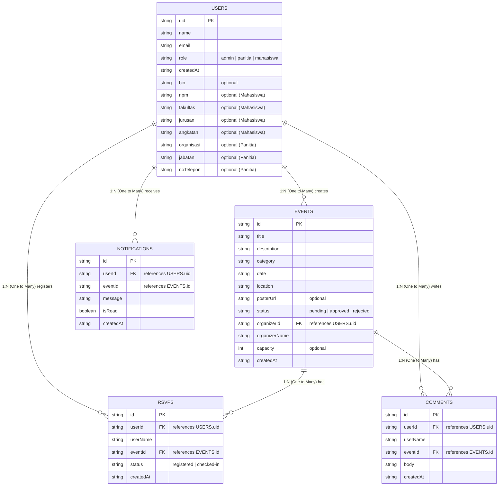
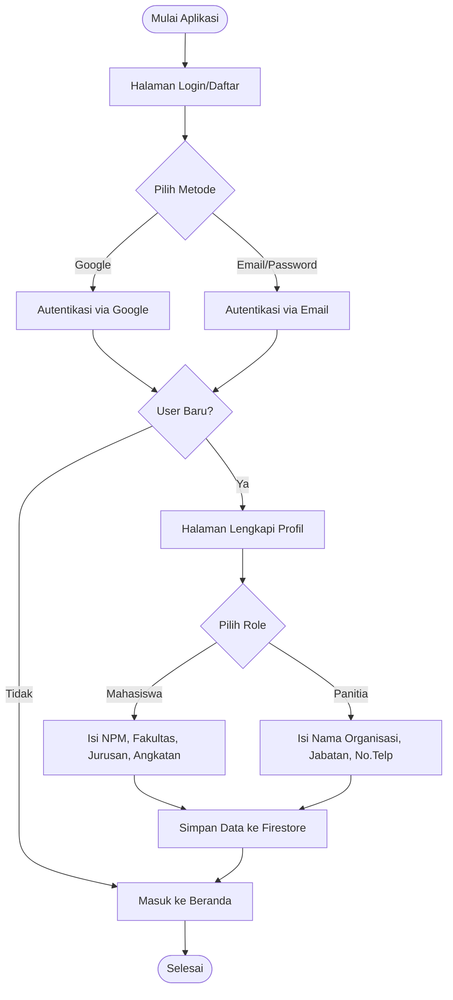
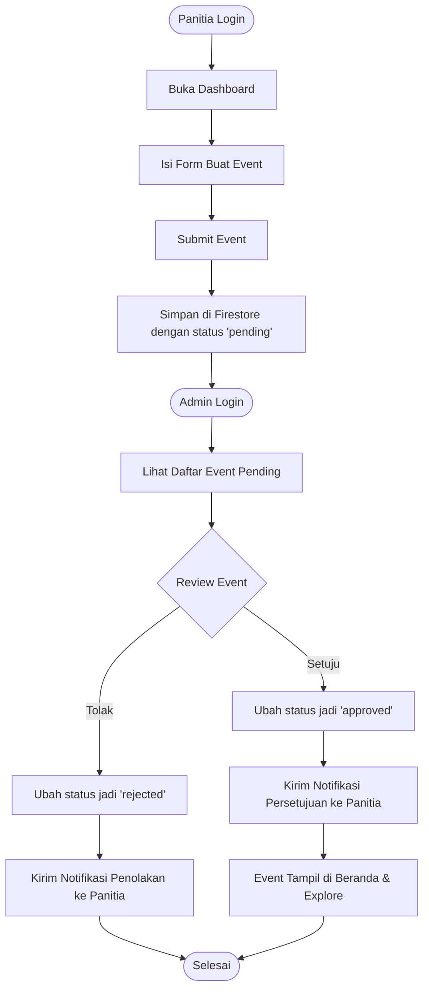
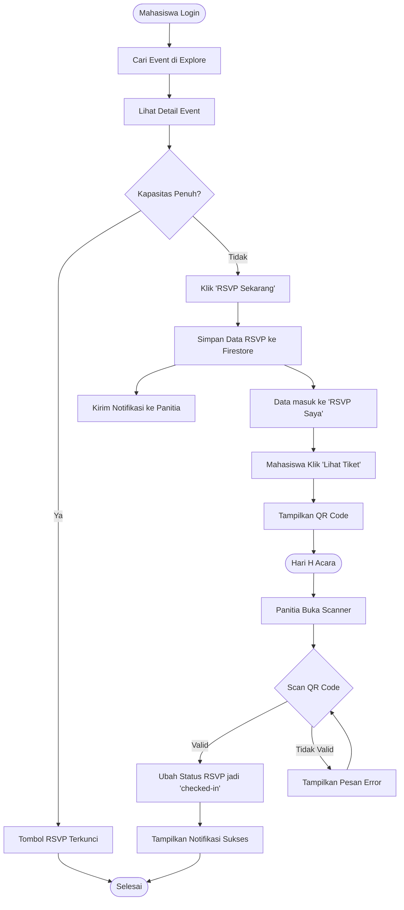

# Dokumentasi Sistem KampusHub

Berikut adalah kode Mermaid untuk Entity-Relationship Diagram (ERD) dan Flowchart sistem kita. Anda bisa menyalin kode di bawah ini dan menempelkannya ke [Mermaid Live Editor](https://mermaid.live/) atau menggunakannya langsung di aplikasi Markdown/Notion Anda.

## 1. Entity-Relationship Diagram (ERD)

ERD ini mencakup seluruh struktur data yang kita simpan di Firebase Firestore, lengkap dengan semua *field* dan relasi antar koleksinya.

### Penjelasan Relasi (Kardinalitas)
Pada sistem Firestore kita, karena menggunakan konsep NoSQL (Document-based), relasi utamanya didominasi oleh **One-to-Many (1:N)**. Penjelasannya:
- **1 User (Panitia) : N Events** $\rightarrow$ Satu panitia bisa membuat banyak event, tapi satu event hanya dimiliki oleh satu panitia pembuatnya.
- **1 User (Mahasiswa) : N RSVPs** $\rightarrow$ Satu mahasiswa bisa mendaftar (RSVP) ke banyak event.
- **1 Event : N RSVPs** $\rightarrow$ Satu event bisa memiliki banyak tiket pendaftaran (RSVP) dari berbagai mahasiswa.
- **1 User : N Comments** $\rightarrow$ Satu pengguna bisa menulis banyak komentar.
- **1 Event : N Comments** $\rightarrow$ Satu event bisa memiliki banyak komentar di dalamnya.
- **1 User : N Notifications** $\rightarrow$ Satu pengguna (baik mahasiswa maupun panitia) bisa menerima banyak notifikasi.

---

## 2. Flowchart Sistem

Berikut adalah Flowchart untuk 3 proses utama yang terjadi di sistem KampusHub.

### A. Flowchart Registrasi & Autentikasi
Alur pengguna saat pertama kali masuk ke aplikasi hingga melengkapi profil.

### B. Flowchart Pembuatan & Persetujuan Event
Alur panitia membuat event hingga disetujui oleh Admin.

### C. Flowchart RSVP & Check-in (Sistem Tiket QR)
Alur mahasiswa mendaftar event hingga di-scan tiketnya oleh panitia.

